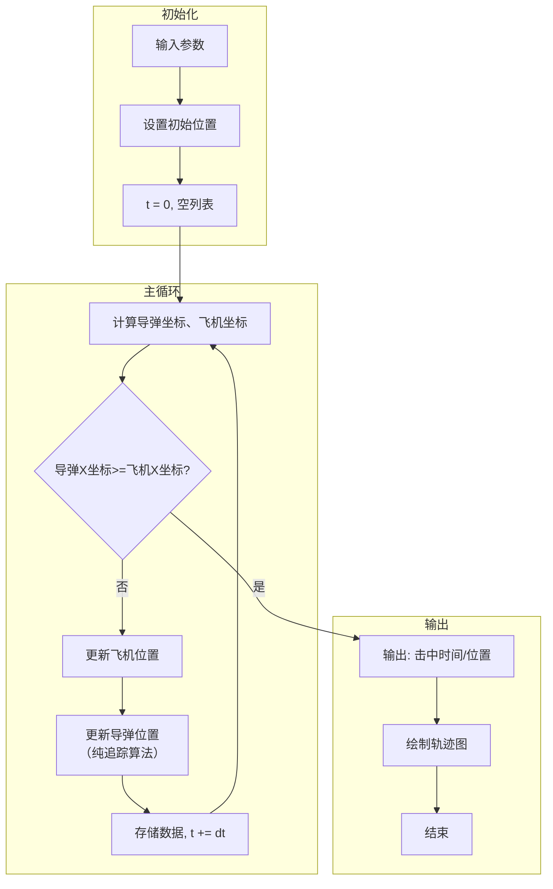

# 导弹追踪飞机模拟

**项目地址**：https://github.com/Aqua65535/Pursuit_Curve

**网页模拟**：https://pursuit-curve.netlify.app/

****

## 一、问题背景

一架飞机在二维平面内以恒定速度水平向右飞行。地面发射一枚导弹，导弹始终朝向飞机的**当前位置**飞行，导弹速度大于飞机速度。

问：导弹能否击中飞机？如果能，击中点在何处？击中时间是多少？

这是一个经典的纯追踪问题（Pure Pursuit Problem），在军事学、机器人导航、控制理论中都有广泛应用。其难点在于：**导弹的飞行方向不是固定的**，而是每时每刻都在改变，始终指向飞机的“当前”位置（而非初始位置或预测位置）。

### 数学描述

设：

- 飞机速度：\( v_p \)（水平向右）
- 飞机初始位置：\( (x_{p0}, y_{p0}) \)
- 导弹速度：\( v_m \)（满足 \( v_m > v_p \)）
- 导弹初始位置：\( (x_{m0}, y_{m0}) \)，通常取 \( (0, 0) \)
- 时间步长：\( \Delta t \)

飞机运动方程为：

\[
\begin{cases}
x_p(t + \Delta t) = x_p(t) + v_p \cdot \Delta t \\
y_p(t) = \text{常数（水平飞行）}
\end{cases}
\]

导弹采用**纯追踪法**：导弹的速度方向始终指向飞机当前的位置。设导弹与飞机的距离为：

\[
d = \sqrt{(x_p - x_m)^2 + (y_p - y_m)^2}
\]

则导弹的速度分量为：

\[
\begin{cases}
v_{mx} = v_m \cdot \dfrac{x_p - x_m}{d} \\[6pt]
v_{my} = v_m \cdot \dfrac{y_p - y_m}{d}
\end{cases}
\]

导弹位置更新：

\[
\begin{cases}
x_m(t + \Delta t) = x_m(t) + v_{mx} \cdot \Delta t \\
y_m(t + \Delta t) = y_m(t) + v_{my} \cdot \Delta t
\end{cases}
\]

**判定击中条件**：当导弹的x坐标大于等于飞机的时候 认为击中。

---

## 二、解法概述

本项目采用**数值积分法（欧拉法）**，通过将连续的时间或空间离散化，用差商近似导数，对上述微分方程进行求解。

1. **初始化**：设置飞机和导弹的初始位置、速度、时间步长、命中距离。

2. **循环迭代**：
   - 计算当前导弹与飞机的距离
   - 判断是否满足击中条件
   - 若未击中，更新飞机位置（水平匀速）
   - 计算导弹指向飞机的单位方向向量
   - 更新导弹位置

   ```python
   def update_missile(x_missile, y_missile, x_plane, y_plane, v_missile, dt):
       dx = x_plane - x_missile
       dy = y_plane - y_missile
       distance = np.sqrt(dx ** 2 + dy ** 2)
   
       if distance > 0:
           vx_missile = v_missile * (dx / distance)
           x_missile += vx_missile * dt
   
           vy_missile = v_missile * (dy / distance)
           y_missile += vy_missile * dt
   
       return x_missile, y_missile
   ```

   - 存储轨迹数据，时间推进 \( \Delta t \)

3. **终止条件**：击中

4. **输出结果**：击中时间、击中位置，并绘制轨迹图

### 算法流程图



### 运行示例（默认参数）

| 参数         | 数值            |
| ------------ | --------------- |
| 飞机速度     | 100 m/s         |
| 飞机初始位置 | (10000, 5000) m |
| 导弹速度     | 300 m/s         |
| 导弹初始位置 | (0, 0) m        |
| 命中距离     | 5 m             |

**模拟结果**：
- 击中时间：54.38 秒
- 击中位置：(15428.7, 4999.9) m

---

## 三、结果分析

### 1. 理论分析

由于导弹速度大于飞机速度（\( v_m > v_p \)），且导弹始终指向飞机，理论上导弹**一定能够击中**飞机。

### 2. 观察现象

- 导弹轨迹是一条**平滑的曲线**，从发射点逐渐靠近飞机的航线
- 导弹的曲率随接近目标而增大

### 3. 参数影响

| 参数变化     | 影响                          |
| ------------ | ----------------------------- |
| 导弹速度↑    | 击中时间↓，轨迹更“直”         |
| 飞机速度↑    | 击中时间↑，需要更长的追逐距离 |
| 初始Y坐标差↑ | 轨迹弯曲程度↑                 |
